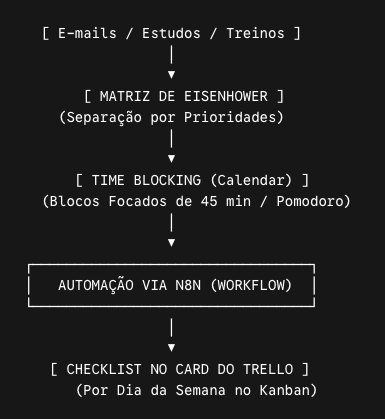
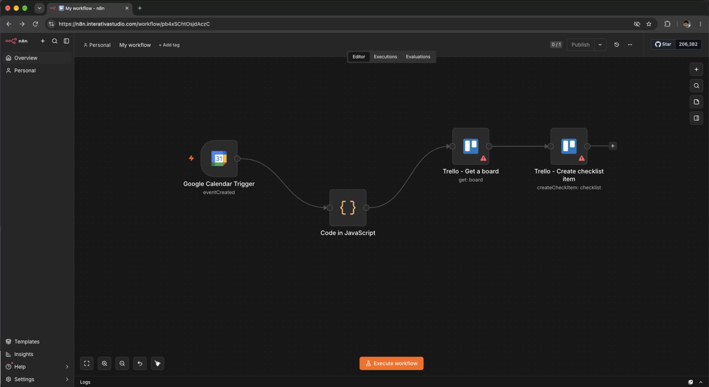
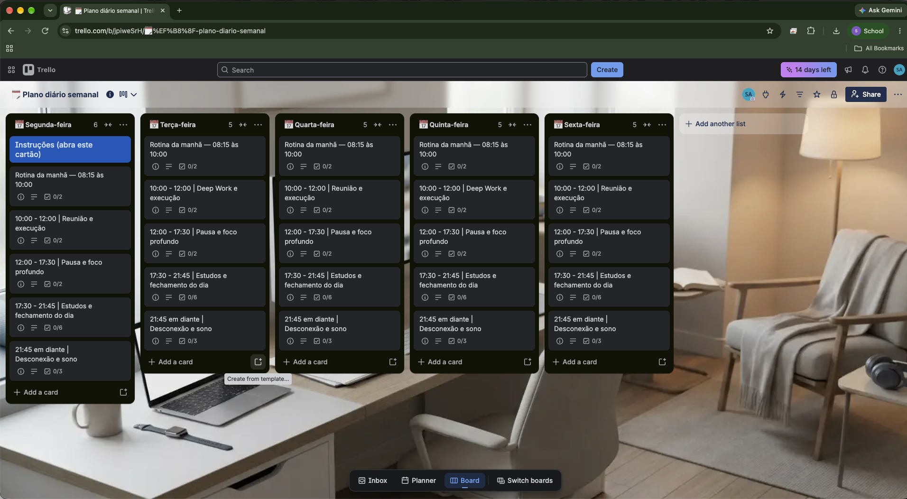
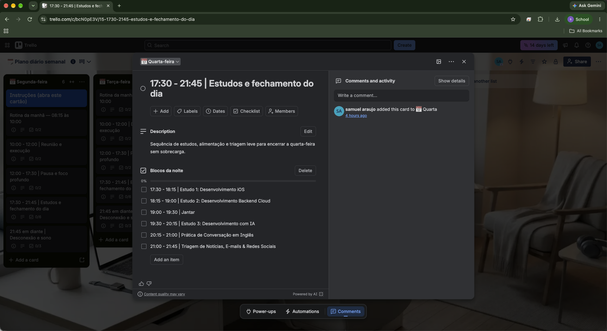

# 🚀 Meu Sistema Operacional Pessoal (POS)
> **Utilizando IA para Gerenciar Tempo, Comunicação e Produtividade**  
> *Trabalho Universitário – Disciplina de Produtividade e Gestão do Tempo*

---

## 📌 Descrição do Sistema

O **Sistema Operacional Pessoal (Personal Operating System – POS)** foi desenvolvido para solucionar um dos maiores gargalos enfrentados por profissionais de tecnologia: a dificuldade em organizar demandas, gerenciar o tempo, comunicar-se de forma eficiente e manter a saúde mental em uma rotina intensa.

Com a alta carga cognitiva exigida no desenvolvimento de software e a dispersão causada por múltiplas fontes de informação, o **POS** estabelece uma arquitetura clara que aloca atividades fixas de trabalho, blocos focados de estudos (*Deep Work* em iOS, Cloud e Inteligência Artificial) e rotinas de bem-estar e exercício físico.

O sistema integra métodos clássicos de gestão de tempo à inteligência artificial e automação de fluxos para mitigar a fadiga de decisão, eliminar o retrabalho e combater a procrastinação.

---

## 🛠️ Ferramentas Utilizadas

| Ferramenta | Categoria | Função no Sistema |
| :--- | :--- | :--- |
| **Google Agenda** | Gestão Temporal | Maestro do tempo e aplicação da técnica de *Time Blocking* para compromissos fixos e blocos de estudo/treino. |
| **Trello** | Gestão de Tarefas | Quadro Kanban para organização visual do backlog de estudos, projetos de desenvolvimento e hábitos. |
| **n8n** | Automação e Orquestração | Motor de automação assíncrona (self-hosted / cloud) que integra o Google Agenda diretamente às checklists do Trello. |
| **Inteligência Artificial (LLMs)** | Tutoria & Sintetização | Redução de tempo na leitura/resumo de e-mails/notícias, criação de roteiros de estudo de 45 min e treino de conversação em inglês. |

---

## 🔄 Fluxo de Organização

A arquitetura do **POS** funciona em três camadas complementares: **Priorização (Estratégica)**, **Alocação (Temporal)** e **Sincronização Automática (Operacional)**.

## Prints 

### Visualização do Fluxo no n8n

### Quadro no Trello

